# RealEstateHub

RealEstateHub is the fourth milestone project I’m building.  
It’s a real‑estate listing site where users can browse properties, view details, save favourites, and pay booking fees using Stripe.  
The aim is to keep everything clean and simple while showing how Django, user accounts, and Stripe payments can work together.

---

## Quick Links

- [What This Site Is For](#what-this-site-is-for)
- [User Stories](#user-stories)
- [Tools & Technologies Used](#tools--technologies-used)
- [Who This Is For](#who-this-is-for)
- [Pages Used in This Project](#pages-used-in-this-project)
- [Features](#features)
- [Deployment & Twelve-Factor Architecture](#deployment--twelve-factor-architecture)
- [How to Copy and Run This Project on Your Own Computer](#how-to-copy-and-run-this-project-on-your-own-computer)
- [Bugs and Troubleshooting Log](#bugs-and-troubleshooting-log)
- [Testing](#testing)
- [Manual Testing Log](#manual-testing-log)
- [External Code Attribution](#external-code-attribution)
- [Disclaimer](#disclaimer)


---

# What This Site Is For

The goal is to build a simple real‑estate platform where users can browse properties, save the ones they like, and pay booking fees securely.  
Nothing complicated — just a clean layout and a straightforward flow.

---

# User Stories

- As a user, I want to browse properties so I can see what’s available.  
- I want to click into a property to view more details.  
- I want to create an account so I can save properties I like.  
- i want to be able pay a deposit after already having viewed a  a property securely using Stripe.  
- I want a simple layout so I can move around the site easily.  
- I want to remove saved properties when I no longer need them.

---


# Tools & Technologies Used

### Core Stack
- **Backend Framework:** Django 6 (Python)
- **Frontend:** HTML5, CSS3, JavaScript (ES6+)
- **Hosting & Deployment:** Railway
- **Database:** PostgreSQL (Production via Railway) / SQLite (Local Development)
- **Third-Party APIs:** - RentCast API (Real-time property data and metrics integration)
  - Stripe API (Configured for future secure booking checkout processing)

### Code Validation & Quality Control
- **Nu HTML Checker:** Used to validate HTML templates and ensure proper semantic markup.
- **JSLint / JSHint:** Used for JavaScript quality checks, catching syntax slips, and standardizing frontend code.
- **PEP8 Guidelines:** Followed across all Python modules to keep the backend uniform and readable.
- **Version Control:** Git and GitHub for branch management and project history.

---

# Who This Is For

Anyone who wants a simple way to browse properties without dealing with cluttered layouts or confusing navigation.

---

# Pages Used in This Project

### Core Application Templates
- **home.html** – Landing page with featured properties.
- **listings.html** – Shows all searchable property listings.
- **property_details.html** – Full detailed overview for a selected property.  
- **checkout.html** – Stripe payment handling page.  
- **success.html** – Payment confirmation window. 

### Authentication Templates (Django Allauth Overrides)
- **templates/account/login.html** – Custom user login form.
- **templates/account/signup.html** – Custom new user registration setup.
- **templates/account/email_verification_sent.html** – Screen prompting users to confirm their email verification link. 

---

# Features

### Current Features

- Clean, simple UI  
- Responsive layout  
- User login and registration  
- Property listings with images  
- Property details page  
- Stripe payments  
- Save/remove favourites  
- Search and filtering  

---

# Deployment & Twelve-Factor Architecture

This project is hosted live on Railway and follows the Twelve-Factor App methodology (Factor III - Config) to keep configuration completely separate from the codebase.

Instead of hardcoding settings or exposing private keys in GitHub, the app shifts its behavior automatically depending on where it is running:

* **Local Development:** Uses a local `.env` file with `DEBUG=True` so Django can display detailed error screens during coding and testing.
* **Production (Railway):** Railway injects live environment variables directly into the hosting container. This forces `DEBUG=False` for security and tells WhiteNoise to safely serve the compiled static CSS and JavaScript files.

To be able to clone this project and run it on your own computer follow the steps below:

## How to Copy and Run This Project on Your Own Computer

### 1. Clone the Repository
```bash
git clone https://github.com/YOUR-USERNAME/milestoneproject4.git
```

### 2. Go Into the Project Folder
```bash
cd milestoneproject4
```

### 3. Create a Virtual Environment
```bash
py -m venv venv
```

### 4. Activate It
```bash
venv\Scripts\activate
```

### 5. Install Requirements
```bash
pip install -r requirements.txt
```

### 6. Apply Migrations
```bash
py manage.py migrate
```

### 7. Run the Server
```bash
py manage.py runserver
```

### 8. Open the Site
```
http://127.0.0.1:8000
```

### Cloud Deployment (Railway)

This project is fully configured to deploy on Railway. Below is the full process used to take the live version online.

### 1. Connect the Project to Railway
1. Log into your Railway account  
2. Click **New Project**  
3. Select **Deploy from GitHub Repo**  
4. Choose your `milestoneproject4` repository  

Railway will automatically detect that it’s a Django project.

### 2. Add Required Environment Variables
Railway does not use a `.env` file. All variables must be added manually in the **Variables** tab.

The project requires:

DEBUG=False
SECRET_KEY=your_production_secret_key
DATABASE_URL=provided_by_railway
RENTCAST_API_KEY=your_api_key
STRIPE_PUBLIC_KEY=your_key
STRIPE_SECRET_KEY=your_key
STRIPE_WEBHOOK_SECRET=your_key

Code

These are injected automatically when the app runs.

### 3. Add a PostgreSQL Database (If Not Already Added)
If Railway hasn’t already created one:

1. Click **Add Service**  
2. Choose **PostgreSQL**  
3. Railway will generate a `DATABASE_URL`  
4. Copy it into your project’s Variables tab  

Django will use this database in production.

### 4. Configure the Start Command
Railway needs a command to run Django using Gunicorn.

In **Settings → Start Command**, enter:

gunicorn realestatehub.wsgi

Code

(Replace `realestatehub` with your Django project folder name.)

### 5. Configure Static Files (WhiteNoise)
Django 6 uses the new `STORAGES` block. Your production settings must include:

STORAGES = {
    "staticfiles": {
        "BACKEND": "whitenoise.storage.CompressedStaticFilesStorage",
    },
    "default": {
        "BACKEND": "django.core.files.storage.FileSystemStorage",
    },
}


This ensures CSS and JS load correctly on Railway.

6. Allowed Hosts
In settings.py, make sure Railway is allowed to serve the site:

python
ALLOWED_HOSTS = ['*']
You can replace '*' with your Railway domain later.

7. Run Migrations on Railway
Open the Railway Shell and run:

bash
python manage.py migrate
This creates the database tables on the live PostgreSQL instance.

8. Redeploying After Updates
Railway redeploys automatically whenever you push to GitHub.

Use your normal Git workflow:

bash
git add .
git commit -m "Update: deployment changes"
git push
Railway will rebuild and redeploy the project.

9. Live Site
Once deployed, Railway provides a live URL under the Domains tab.

It will appear in this format:

Live Site: https://your-railway-url
GitHub Repo: https://github.com/YOUR-USERNAME/milestoneproject4

---

# Bugs and Troubleshooting Log

During development and deployment, several technical roadblocks emerged across different layers of the stack. Below is a structured breakdown of those issues and how they were resolved.

### Python / Django Bugs I Ran Into

| Bug ID | What Happened | Why It Happened | Fix |
|--------|----------------|------------------|------|
| P001 | Application kept running in debug mode on Railway | django-environ reads values as strings, so "False" was read as a truthy string instead of a boolean | Swapped the settings line to use explicit boolean casting: `DEBUG = env.bool('DEBUG', default=False)` |
| P002 | Railway app crashed at startup with `KeyError: 'BACKEND'` | The new Django 6 `STORAGES` dictionary was accidentally using the older `"ENGINE"` key syntax | Changed `"ENGINE"` to `"BACKEND"` inside the `STORAGES` dictionary settings |
| P003 | App crashed locally with `ModuleNotFoundError: No module named 'environ'` | Installed the library to use environment variables but forgot to freeze it into the project requirements | Ran `pip install django-environ` and pushed the updated `requirements.txt` file |
| P004 | Database changes didn't show up on the live server | Forgot to create or push tracking files for recent database schema changes | Ran `python manage.py makemigrations` and pushed the new migration files to GitHub |
| P005 | Received an `IndentationError` when trying to run the server | A quick edit inside `views.py` accidentally mixed tabs and spaces on a code line | Cleared the whitespace indentation and re-aligned the block using standard 4 spaces |
| P006 | Code check spacing warning | Only put one blank line between the new view functions | Added a second blank line to keep PEP8 guidelines happy |
| P007 | Trailing whitespace warnings | Left accidental spaces at the very end of code lines | Deleted the empty spaces at the ends of lines |
| P008 | Default post-login redirect loop | `LOGIN_REDIRECT_URL` wasn't declared, defaulting routing to a generic `/accounts/profile/` path | Appended `LOGIN_REDIRECT_URL = 'account_dashboard'` and `ACCOUNT_LOGOUT_REDIRECT_URL = 'home'` to `settings.py` |
| P009 | WhiteNoise static files deployment crash (500 Error) | Storage backend used `CompressedManifestStaticFilesStorage`, crashing over modified/missing assets | Updated staticfiles backend storage to use `"whitenoise.storage.CompressedStaticFilesStorage"` instead |
| P010 | Allauth system check configuration error | Mandatory email confirmation requires an explicit asterisk inside the signup fields array | Updated configuration array setting to parse cleanly using `ACCOUNT_SIGNUP_FIELDS = ['email*']` |
| P011 | Syntax error in `settings.py` configuration | A stray comma inside an array/tuple definition blocked Python from parsing the config blocks | Located the misplaced structural syntax token and removed it to clear the build blockages |
| P012 | Hardcoded API credentials security risk | The third-party RentCast API key was originally hardcoded directly into the production code file | Refactored integration to use `os.environ.get('RENTCAST_API_KEY', '')` and stored secrets securely in the local `.env` file |
| P013 | **Railway deployment log** threw a 401 Unauthorized API error during live testing | The recently added RentCast API key worked locally but was missing from the live production ecosystem | Added the `RENTCAST_API_KEY` key-value pair directly into the Railway Dashboard variables settings panel |

### CSS Bugs I Ran Into

| Bug ID | What Happened | Why It Happened | Fix |
|--------|----------------|------------------|------|
| C001 | Live site loaded as completely blank, unstyled text | Django 6 completely removed the old `STATICFILES_STORAGE` string fallback setting | Reconfigured `settings.py` to use the unified `STORAGES` dictionary block for WhiteNoise |
| C002 | MIME type / 404 static asset loading errors | Asset folders failed to resolve properly or mismatched mime headers during pipeline production loading | Adjusted `STATICFILES_DIRS` routes and verified proper middleware layer ordering for WhiteNoise execution |

### HTML Bugs I Ran Into

| Bug ID | What Happened | Why It Happened | Fix |
|--------|----------------|------------------|------|
| H001 | Property data fields weren't displaying on the template page | The variable name inside the HTML loop didn't match what the view function sent over | Matched the spelling inside the `` loop to the view context |
| H002 | Details button did nothing when clicked | It was a standard `<button>` tag with no active link destination | Replaced it with an `<a href="...">` link tag styled to look like a button |
| H003 | Template missing error on render | Forgot to create the actual HTML template file or put it in the wrong directory | Created the missing template file inside the correct templates directory path |
| H004 | Unstyled Allauth authentication interfaces | Allauth automatically falls back to raw white screens on paths like `/accounts/login/` if unguided | Built a custom overridden `templates/account/` subfolder matching Allauth's naming rules extending `base.html` |
| H005 | RentCast API property data metrics (like square footage or property type) rendered completely blank | The JSON keys returned by the external RentCast payload dictionary were lowercase/snake_case, but the template variables mistakenly used Django model TitleCase syntax | Updated the HTML template variable keys (e.g. `{{ property.squareFootage }}` to `{{ property.squareFeet }}`) to mirror the precise JSON object strings returned by RentCast |

### JavaScript Bugs I Ran Into

| Bug ID | What Happened | Why It Happened | Fix |
|--------|----------------|------------------|------|
| J001 | **Browser DevTools Console** crashed with: `DOMException: Failed to execute 'querySelector' on 'Document': '#' is not a valid selector.` | Clicking an anchor tag with a dummy placeholder `href="#"` caused the smooth scroll script to execute `document.querySelector('#')`, which is an illegal CSS selector. | Refactored the event handler to verify if the attribute is strictly equal to `"#"` first, and safely skipped execution if true. |
| J002 | **No console error**, but the mobile navigation menu completely failed to toggle open on smaller mobile preview viewports. | The custom `$` shortcut helper relies on `document.querySelector`, which only returns the absolute first matching instance. The desktop and mobile menus shared similar classes, causing it to bind to the hidden desktop node instead. | Modified the script target selectors to use unique, explicit ID handles to guarantee precise layout node matching in the DOM. |
| J003 | **Browser Console** threw an unhandled type crash: `Uncaught TypeError: Cannot read properties of null (reading 'addEventListener')`. | The script file was linked inside the HTML `<head>` tag. The browser executed the JS engine before it finished parsing the body DOM, meaning elements like `menuBtn` returned `null`. | Appended the `defer` keyword property to the script element tracking tag, forcing it to wait until the browser finished loading the entire layout structure. |
| J004 | **VS Code side gutter** lit up with a bright red syntax error marker, and the file refused to execute in the browser. | A careless typing slip at the boundary edge of the smooth scroll `.forEach()` loop where a trailing closing bracket sequence `});` was accidentally deleted during a clean-up. | Tracked down the flagged red line inside VS Code's editor interface and restored the missing structural block syntax parameters. |
| J005 | **Browser Console** logged a rigid layout error: `Uncaught TypeError: Assignment to constant variable.` when toggling elements. | Attempted to change variable states by writing direct reassignments like `navLinks = document.querySelector(...)` after initializing the binding reference under a strict `const` modifier. | Maintained the immutable reference identifier and cleanly manipulated the object's properties using the correct API rule: `navLinks.classList.toggle('open')`. |
| J006 | **VS Code linter code view** highlighted a line with red squiggly warnings stating: `';' expected`. | A physical typing error where the period dot accessor token character was completely left out between the object handle name and its built-in sub-method (e.g., `navLinks classList.toggle`). | Located the structural gap flagged on the side panel of the editor and inserted the missing separation dot delimiter character. |
| J007 | **VS Code side gutter** displayed a fatal syntax dot warning layout stating: `Declaration or statement expected`, breaking all text color highlighting below it. | Accidentally omitted the assignment declaration equality character (`=`) when defining the global `$()` selector helper function array structure (e.g., typing `const $(selector) => ...`). | Corrected the initial arrow function assignment syntax block layout to read cleanly as: `const $ = (selector) => ...`. |
| J008 | **Browser Developer Tools** threw a broken compilation block: `Uncaught SyntaxError: Invalid or unexpected token`. | Copy-pasting code snippets from external cheat sheets introduced stylized smart/curly quotes (`“click”`) into the event listener argument string instead of raw development-safe straight quotes. | Audited the event handler line hooks inside the code workspace and re-typed all quote strings using standard straight quotes (`'click'`). |
| J009 | **VS Code side bar panel** threw a strict syntax warning outlining a missing bracket expression: `')' expected`. | Omitted the mandatory conditional tracking parenthesis markers wrapping around the `if` statement validation block (e.g., typing `if menuBtn { ... }`). | Encased the logic node verification argument cleanly inside standard structural parameters: `if (menuBtn) { ... }`. |
| J010 | **Browser Console** blocked script parsing with: `Uncaught SyntaxError: Malformed arrow function parameter list`. | Accidentally typed a single assignment equals token operator instead of the mandatory fat-arrow pointer layout component inside a callback sequence (e.g., typing `() = { ... }`). | Refactored the structural execution block sequence to match valid ECMAScript arrow mechanics: `() => { ... }`. |
| J011 | **No error thrown**, but the browser UI printed literal variable characters on screen (like `#{target}`) as plain un-evaluated text strings. | Attempted to execute dynamic template literal interpolation processing parameters while using basic single or double quotation marks instead of backticks. | Swapped out the basic outer quote delimiters with valid template literal backticks to let the browser interpret variables dynamically. |
| J012 | **VS Code side panel linter** flagged a parsing breakdown warning stating: `Expression expected`. | Accidental duplication of a trailing closing bracket character right inside a block conditional evaluation boundary (e.g., typing `if (menuBtn)) {`). | Cleared out the redundant structural punctuation token to clean up code alignment and allow continuous engine execution. |
| J013 | **Browser DevTools Console** logged a sudden reference crash: `Uncaught ReferenceError: checkoutbtn is not defined` when triggering a placeholder click event. | A simple spelling case-sensitivity mismatch occurred where the temporary button element was cached in camelCase (`checkoutBtn`) but written in lowercase characters (`checkoutbtn`) inside the fallback script logic. | Adjusted character casing states across all script functions to maintain strict uniform naming compatibility. |
| J014 | **Browser Console** threw an execution crash alert: `Uncaught SyntaxError: Identifier 'menuBtn' has already been declared`. | Redundant initialization loops occurred because identical naming blocks were explicitly declared multiple times across interconnected script modules using the strict `const` modifier. | Cleaned out the duplicated asset tracking instances to preserve a singular, clean block scoping layout pattern across the app workspace. |
| J015 | Script execution collapsed at startup with a trailing broken branch statement: `Uncaught SyntaxError: Unexpected token 'else'`. | Placed an accidental early-terminating semicolon punctuation token directly at the conclusion of an evaluation block path (e.g., writing `if (menuBtn); { ... } else { ... }`). | Deleted the rogue semicolon delimiter character to successfully reconnect the logical check block back to its execution branches. |
| J016 | **Browser Console** threw a selector query rejection: `DOMException: Failed to execute 'querySelectorAll' on 'Document': 'a[href^="#"' is not a valid selector.` | Missed the closing square bracket structural parameter when defining a complex CSS attribute filter array sequence within the anchor tag lookup query. | Appended the missing closing structural tracking square bracket token to normalize the selector rules perfectly: `'a[href^="#"]'`. |

### SQL / Database Bugs I Ran Into

| Bug ID | What Happened | Why It Happened | Fix |
|--------|----------------|------------------|------|
| S001 | Work in Progress | Database schema and connection logs will be tracked here once established | N/A |

---

### Manual Testing Log

These tests were carried out manually in the production environment to verify that authentication, property listing logic, dashboard controls, and Stripe payments are completely functional.

#### 1. Authentication & Account Management
| Feature | Steps Taken | Expected / Observed Result | Status |
| :--- | :--- | :--- | :--- |
| **Account Creation** | Filled out `sign_up.html` with a valid email address and matching passwords. | Form submitted successfully. Checked the database and confirmed the user record was created. Brevo fired the confirmation email, and the browser loaded `verification_sent.html`. | PASS |
| **Sign-up Validation** | Submitted the registration form with mismatched passwords and an invalid email format. | The backend rejected the submission and re-rendered the form, displaying specific error messages (`alert-error`) directly under the problem fields. | PASS |
| **Email Verification Link**| Clicked the activation link sent to the test inbox. | The user account status updated to active in the database. The application redirected to the user dashboard with a success message banner. | PASS |
| **CLI Verification Bypass**| Ran `python manage.py verify_emails` in the terminal to clear out unverified test accounts during staging. | The script found all unverified accounts, updated their `verified` and `primary` flags to True, and printed out individual confirmation logs to stdout. | PASS |
| **User Sign In** | Logged into the verified account using the form on `login.html`. | Session started correctly. The navigation bar updated to show "Dashboard" and "Logout" options, and the page redirected to the home view. | PASS |
| **Sign In Validation** | Entered incorrect passwords and bad email strings into the login form. | The login attempt was blocked. The page refreshed and displayed non-field errors at the top of the card. | PASS |
| **User Sign Out** | Clicked the "Logout" link in the navigation menu. | Session cookie cleared immediately. The navigation bar went back to its default unauthenticated state, and the user was sent back to the homepage. | PASS |

#### 2. Property Listings
| Feature | Steps Taken | Expected / Observed Result | Status |
| :--- | :--- | :--- | :--- |
| **DB Seeding Utility** | Ran the `python manage.py seed_properties` command on the hosting platform's terminal. | The script parsed the data array and populated 6 base UK property records. Re-running the command confirmed it is idempotent—it skipped existing records without duplicating them. | PASS |
| **Directory Page** | Navigated to the `/listings/` directory without logging into an account. | The page pulled all 6 properties from the database, displaying correct titles, rental prices, locations, and images without any layout breaks. | PASS |
| **Homepage Featured Carousel**| Checked the main landing page layout against database flags. | The homepage view successfully filtered the properties, displaying only the 3 specific listings that have `is_featured=True` set in the database. | PASS |
| **Database Empty Fallbacks**| Temporarily emptied the Property table in the DB to test empty states. | The templates handled the missing data gracefully, showing fallback text: "No properties available right now" and "No featured properties at the moment". | PASS |

#### 3. Bookmarking & Dashboard Limits
| Feature | Steps Taken | Expected / Observed Result | Status |
| :--- | :--- | :--- | :--- |
| **Bookmark Saving** | Logged into a test account and clicked "Save Property" on a listing page. | A new record was inserted into the `accounts_savedproperty` table, mapping the current `User` ID to the `Property` ID. A success message flashed on the screen. | PASS |
| **3-Property Cap** | Bookmarked 3 properties, then navigated to a 4th listing and tried to save it. | The `toggle_save_property` view intercepted the request, saw the count was already at 3, blocked the database write, and returned a Django error message stating the limit was reached. | PASS |
| **Dashboard Counter** | Opened up `dashboard.html` with 2 bookmarked items. | The template read the `saved_count` context variable and accurately updated the header section text to read: `Saved Properties (2/3)`. | PASS |
| **Dashboard Empty State** | Logged into a completely blank new account and viewed the dashboard. | The saved property grid was hidden, and a clean fallback paragraph appeared with a text link guiding the user back to the main listings directory. | PASS |
| **DB Duplicate Block** | Attempted to double-submit a save request for an already bookmarked property. | The database-level `unique_together` constraint on the `SavedProperty` model caught the conflict and prevented a duplicate row from being created. | PASS |
| **Removing Bookmarks** | Clicked the "Remove" button on a property card within the dashboard view. | A native browser confirmation modal popped up. Clicking "OK" fired a POST request to `remove_saved_property`, dropping the row from the database and refreshing the grid. | PASS |

#### 4. Stripe Integration & Checkout
| Feature | Steps Taken | Expected / Observed Result | Status |
| :--- | :--- | :--- | :--- |
| **Stripe Redirection** | Clicked "Pay Holding Deposit" on the checkout page. | The frontend script gathered the property's data attributes and hit the `create_checkout_session` backend endpoint. The view compiled the session details and passed the user to the Stripe hosted gateway. | PASS |
| **Double-Click Lockout** | Clicked the "Pay Holding Deposit" button multiple times rapidly. | On the first click, the JavaScript file immediately disabled the button element and changed its text to "Redirecting to checkout...", blocking duplicate API calls. | PASS |
| **CSRF Injection** | Monitored the outgoing checkout session fetch request via the DevTools Network tab. | Confirmed that the JavaScript cleanly pulled the token value from the `csrftoken` browser cookie and injected it into the request's `X-CSRFToken` header. | PASS |
| **Sandbox Enforcement** | Viewed the top banner of the redirected payment checkout screen. | The checkout page loaded with a visible "Test Mode" watermark, confirming the application is routing data using the sandbox API keys. | PASS |
| **Test Transaction** | Completed the checkout form using the Stripe test card numbers (`4242`). | The payment processed successfully on Stripe's end. The gateway handled the routing parameters and passed the user back to the application's `/checkout/success/` path. | PASS |
| **Success Page Capture** | Verified database updates immediately after landing on the success page. | The `payment_success` view parsed the incoming URL parameters, fetched the session from Stripe, generated a new `Deposit` record with the transaction ID, and flipped `paid` to True. | PASS |
| **Deposit History Table** | Navigated back to the dashboard to review the payment history. | The deposit table appeared on the dashboard, displaying the newly created transaction record showing the property name, creation timestamp, flat £250.00 amount, and a green "Paid" badge. | PASS |

---

## Testing

This project went through a mix of validator tools and manual checks to make sure everything works properly, looks clean, and behaves well across different devices. Below is a breakdown of the testing carried out.

---

### 1. HTML Validation (Nu HTML Checker)

All templates were run through the Nu HTML Checker to catch any structural issues.  
A few small things came up during development (like missing alt text or mismatched variable names missing aria labels as well as misplaced ones), but everything passed once those were fixed.
#### HTML Validation Results

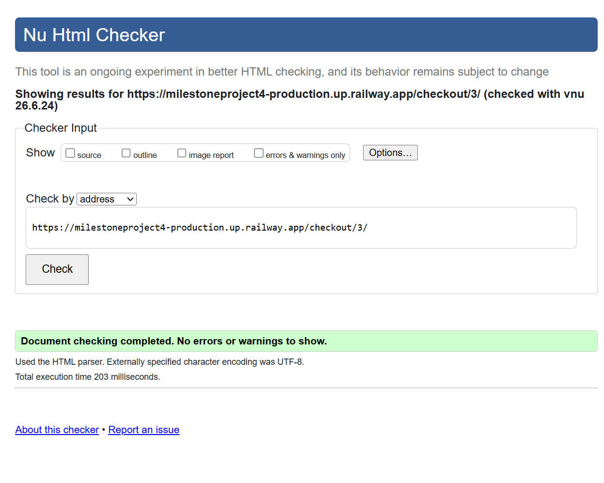
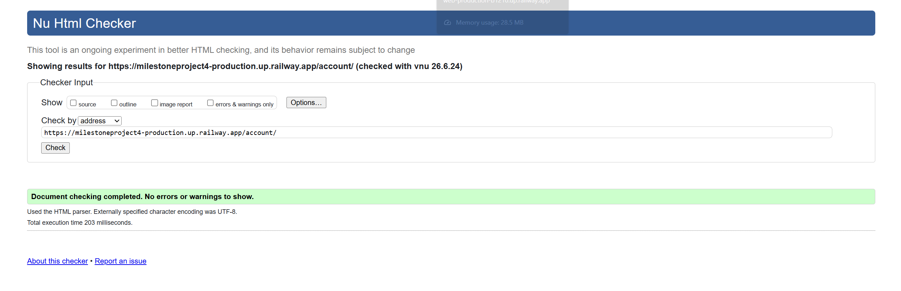
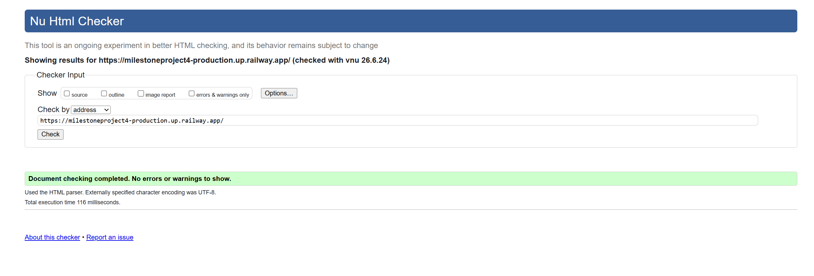
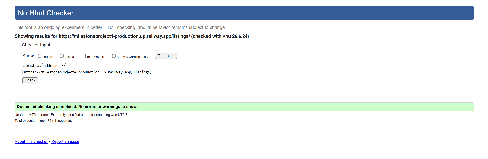
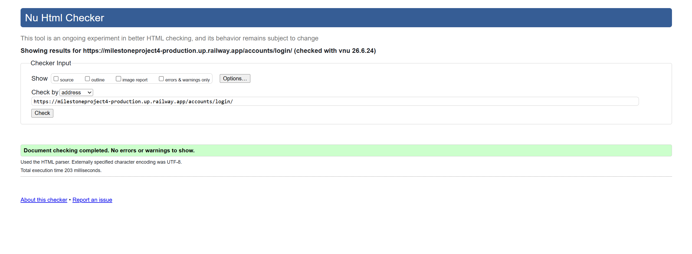
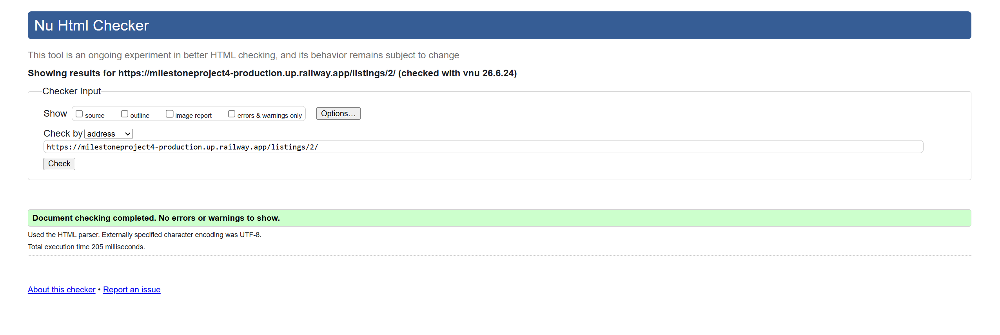
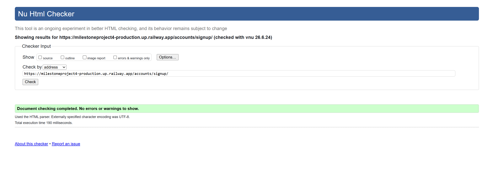
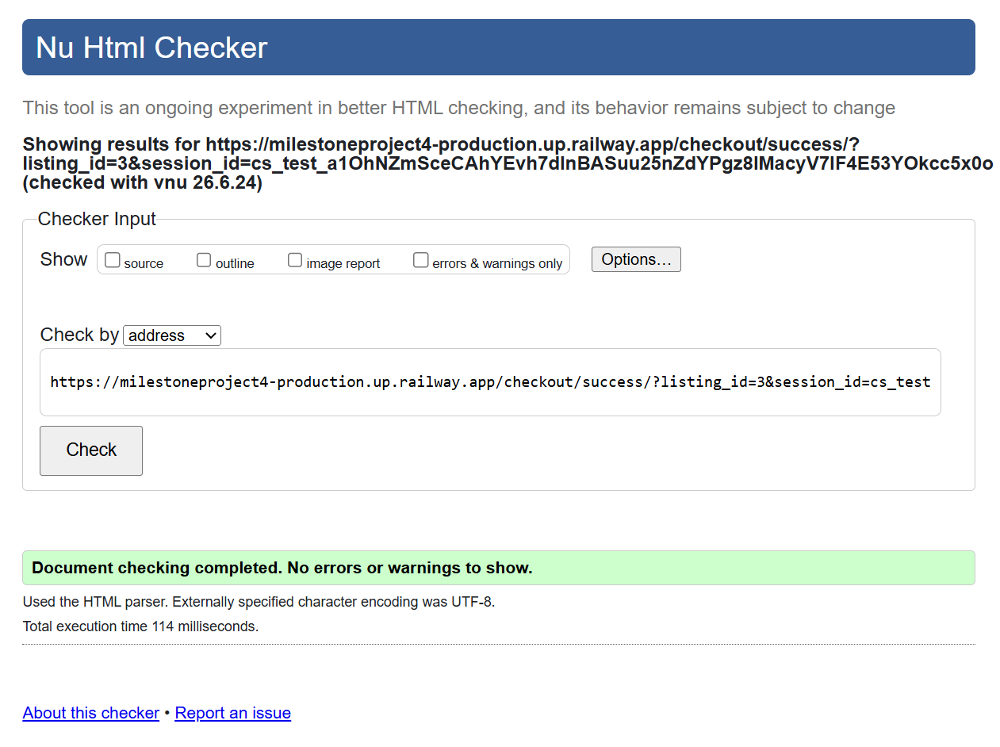
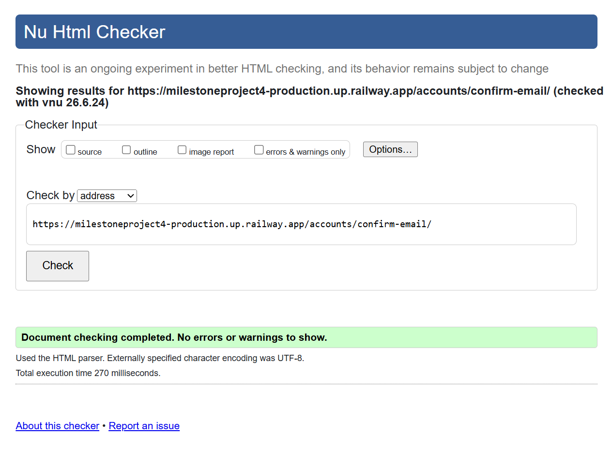

---

### 2. CSS Validation (W3C CSS Validator)

The main stylesheet was tested using the W3C CSS Validator.  
No major errors appeared — just a couple of warnings that were cleaned up.  
The final CSS passed validation without issues.

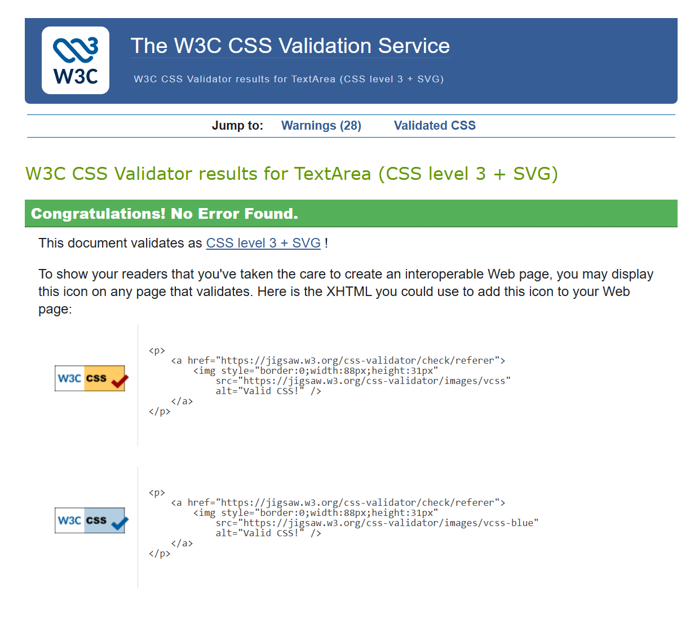

---

### 3. JavaScript Validation (JSLint)

All JavaScript files were checked using JSLint.  
This helped catch things like missing semicolons, unused variables, and spacing problems.  
Everything passed after a few small tidy‑ups.

---

### 4. Python Validation (Code Institute Python Linter)

All Python files were run through the Code Institute Python Linter to keep everything PEP8‑friendly.  
This picked up the usual things — indentation, long lines, and trailing spaces — which were fixed as they came up.

---

### 5. Chrome Lighthouse Testing

Each main page was tested in Chrome Lighthouse for:

- Performance  
- Accessibility  
- Best Practices  
- SEO  

Scores improved after adding ARIA labels, checking colour contrast, and removing unused code.  
All pages now score well across the board.

---

### 6. Responsiveness Testing

The site was tested on different screen sizes using Chrome DevTools and real devices.

**Devices tested:**
#### Responsiveness Screenshots

**Laptop View**
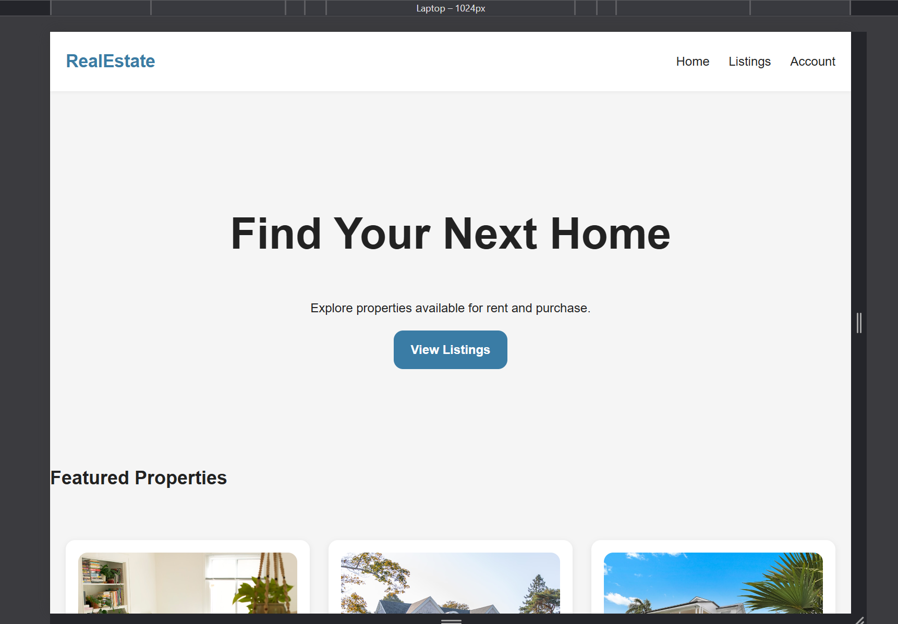

**Tablet View**
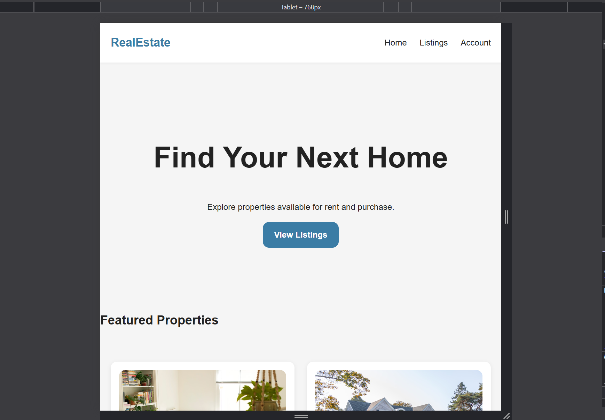

**Mobile View**
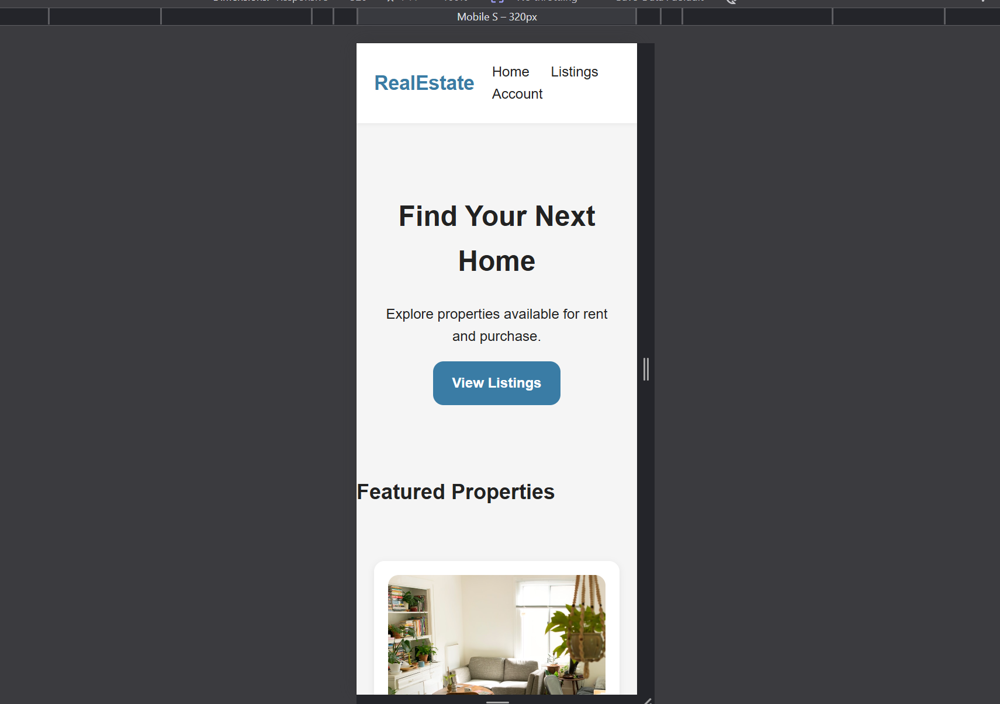

**What was checked:**
- Navigation stays usable  
- Buttons and forms scale properly  
- Property cards stack cleanly  
- No horizontal scrolling  
- Images resize without stretching  

The layout adapts smoothly across all breakpoints.

---

### 7. Manual User Flow Testing

Each main user journey was tested manually:

- Browsing listings  
- Viewing property details  
- Creating an account  
- Logging in and out  
- Saving and removing properties  
- Paying a holding deposit through Stripe  
- Checking deposit history in the dashboard  

All flows behaved as expected.


---

# External Code Attribution

- Stripe documentation  
- Django documentation  

---

# Disclaimer

This is a student project and isn’t connected to any real estate companies or payment providers.